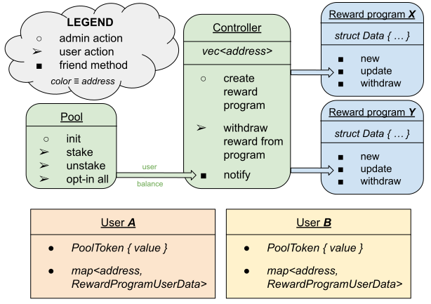

[](LICENSE)


# Aptos Staking

An open source Staking written in the [Move](https://github.com/move-language/move) language for the [Aptos](https://github.com/aptos-labs/aptos-core) blockchain.

Please refer to [documentation](doc) for more details about the package.
<br>
<br>
<br>

<br>
<br>

### Useful links
- [Aptos CLI installation](https://aptos.dev/cli-tools/aptos-cli-tool/install-aptos-cli/)
- [Move book](https://move-language.github.io/move/)
- [Awesome Move](https://github.com/MystenLabs/awesome-move)


## Run locally

##### <a name="network"></a>Start local testnet (reset if already exists):
```
aptos node run-local-testnet --with-faucet --force-restart --do-not-delegate --assume-yes
```

##### <a name="account"></a>Create account `default`:
```
PROFILE=default
aptos init --network local --assume-yes --profile $PROFILE
```

##### Build the package:
```
aptos move compile --named-addresses creator=default,module_account=default
```

##### <a name="publish"></a>Build & publish the package:
```
aptos move create-resource-account-and-publish-package --seed 42 --named-addresses creator=default --address-name module_account
```
The above command will display an adress under which the package has been published.<br>
It is the `module_account` address, i.e. pool address. From now on assume the address is `e6ce9f81c9213ac39c97f6f48a584fc3e5673f1d9bbf19782bfd51ebc4b296de`.

After publishing, the module needs to be initialized from the same account as the publisher. The initialization method takes `T` as a type argument, meaning that the pool will be used to stake `Coin<T>`. For example, let's use native `0x1::aptos_coin::AptosCoin`: 
```
aptos move run --function-id e6ce9f81c9213ac39c97f6f48a584fc3e5673f1d9bbf19782bfd51ebc4b296de::pool::init --profile default --type-args 0x1::aptos_coin::AptosCoin
```

##### <a name="program"></a>Create a reward program:
We will use the native `0x1::aptos_coin::AptosCoin`, but a different reward coin type could be used.
The arguments are (in order): `end_time` - unix timestamp in seconds, `reward_rate` - per second, `tier_return` - percent per full tier staked.
```
aptos move run --function-id e6ce9f81c9213ac39c97f6f48a584fc3e5673f1d9bbf19782bfd51ebc4b296de::controller::create_reward_program --type-args 0x1::aptos_coin::AptosCoin --args u64:1 u64:1 u64:1
```
You can examine the local blockchain time with:
```
aptos node show-epoch-info
```

##### Stake
In this example, the `user1` stakes `1000` Octas (Octa = 1e-8 AptosCoin).
```
aptos move run --function-id e6ce9f81c9213ac39c97f6f48a584fc3e5673f1d9bbf19782bfd51ebc4b296de::pool::stake --profile user1 --type-args 0x1::aptos_coin::AptosCoin --args u64:1000
```

##### Inspect `user1`'s assets
```
aptos account list --account user1
```

##### <a name="inspect"></a>Inspect module's resources
```
aptos account list --query resources --account e6ce9f81c9213ac39c97f6f48a584fc3e5673f1d9bbf19782bfd51ebc4b296de
```

## Interactive testing
Replace the variables in `env.sh` file with addresses generated by your machine when [publishing](#publish) the package (`e6ce9f81c9213ac39c97f6f48a584fc3e5673f1d9bbf19782bfd51ebc4b296de` in our example) and [creating](#program) reward programs manually. You can display reward program addresses by [inspecting](#inspect) module resources.
Then you can run multiple interactive testing sessions in the current shell, using the scripts described below.

To initialize a fresh, interactive testing session, [reset](#network) the local blockchain first, then use the command:
```
bash setup.sh
```

The script does the following:
* setups `default`, `user1`, and `user2` profiles
* builds and publishes the package
* initializes the `pool` module
* creates a reward program

Then, you might start the actual interactive testing using a helper script `test.sh` that can do the following:
```
# General commands
bash test.sh compile # Check if the code compiles
bash test.sh show   # Display pool information
bash test.sh wait [time in seconds]

# Reward-program related commands
bash test.sh new [end_time delay in seconds] [reward_rate] [tier_return]
bash test.sh show [program index]
bash test.sh fund [program index] [amount]

# User-related commands
bash test.sh user1 stake [amount]
bash test.sh user1 unstake [amount]
bash test.sh user1 ping
bash test.sh user1 show
bash test.sh user1 show_updated # ping, then show
bash test.sh user1 withdraw [optional: program index, default: 0]
```

Optionally, use the `chmod +x test.sh` command to simply then use `./test.sh`.

### Semi-automated tests
Run one of the following tests scenarios and look at their sources to see what is the expected output:
```
bash tests/scenario_1.sh    # One reward program, two users, basic correctness tests
bash tests/scenario_2.sh    # Corner cases, tests where a transaction should fail
bash tests/scenario_3.sh    # Many users and different reward programs
```
The rewards calculated might slightly differ at random because they are time-dependent so they depend on performance of your local blockchain.
