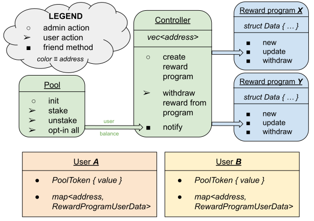

# Documentation
-  ## <a href="pool.md">Pool</a>
-  ## <a href="controller.md">Controller</a>
-  ## <a href="reward_program.md">Reward program</a>
 

The `staking` package consists of three modules: `pool`, `controller`, and `reward_program`. 
Although all package modules have to be published under the same address, 
it is only `pool` and `controller` that store their singleton data structs under the module address, 
where all `Coin<T>` transfers happen through the `pool` to / from the module address. 

The `reward_program` module is only supposed to produce:
- `RewardProgram` struct, that will be stored under a new, reward program's address
- `RewardProgramUserData` struct, that will be stored under the corresponding user's address

A `reward_program::new<R>()` method automatically creates a new resource account, puts there an instance of the `RewardProgram` struct, and returns the address of the newly created resource account. 
The reward program creator is supposed to provide the returned address to the `controller::register_reward_program()` method in order to register the reward program. 
When creating a `new<R>` reward program, the creator has to provide `end_time` (unix timestamp in seconds), `reward_rate` (in token precision per second), and `tier_return` (in percents) arguments. The program starts immediately. In case there is not enough `Coin<R>` balance to `withdraw_reward<R>` to an user, the program pays as much as the balance allows.

Both `pool` creator and `reward_program` creator will not have an access to the resources' accounts. 
Only the module creator can create new reward programs. Currently, there is no mechanism implemented for unregistering / destroying a reward program / pool.

The `pool`'s solely responsibility is to store user-staked coins under the module address. 
It does not know about reward programs, but it calls `controller::notify()` method, either when
* an user `stake`'s / `unstake`'s an amount of `Coin<T>`
* an user calls `pool::ping()` method

The `controller::notify()` method ensures the user is opted-in all available reward programs, 
and notifies the programs about the user's current balance.

Recall, that all coin transfers, staking, unstaking, and reward withdrawals happen in the coin precision. For example, the native `AptosCoin` has precision of `10^8` and transfers are done in that precision, where 1 unit is called `Octa` and a gas unit price is expressed in Octas.

 
 
 

